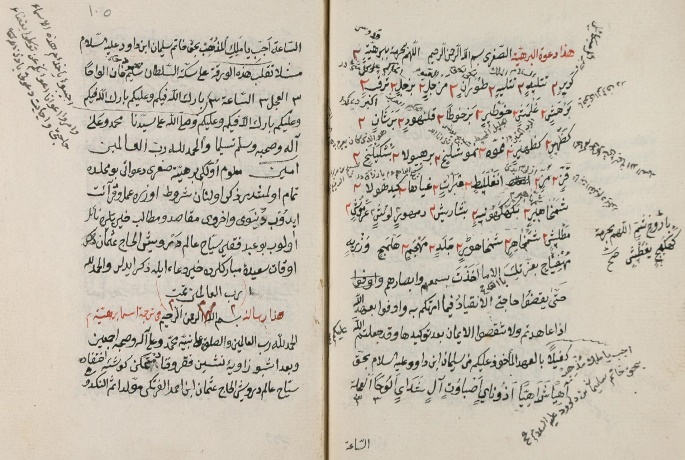
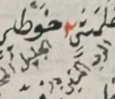

Repository for supporting files and outcomes for my paper entitled ___"Enhancing the Resolution of Historical Ottoman Texts Using Deep Learning-Based SuperResolution Techniques"___  published in the journal ___Traitement du Signal ( ISSN: 0765-0019 (print);  1958-5608 (online) )___

Please cite the paper as follows:

*Temiz, H. (2023). Enhancing the resolution of historical Ottoman texts using deep learning-based super-resolution techniques. Traitement du Signal, Vol. 40, No. 3, pp. 1075-1082* 
[https://doi.org/10.18280/ts.400323](https://doi.org/10.18280/ts.400323)

&nbsp;

## Overview
The following deep learning algorithms are exploited to obtain super-resolved 
images of Ottoman texts:

* DECUSR
* SRCNN
* VDSR
* RED-Net 
 
The pre-trained weights of the algorithms are stored in the **weights** folder.
The implementations of the algorithms can be found in the **models** folder.

The entire study was conducted with
[DeepSR](https://www.sciencedirect.com/science/article/pii/S2352711022001790) framework that
provides an integrated development environment for image super-resolution studies.
It is an open source software. PLease visit the [Github page](https://github.com/htemiz/DeepSR) for the source code
and [PyPI](https://pypi.org/project/DeepSR/) repository to download. To install the program:

`pip install DeepSR`

## How To Run
Each model files is of DeepSR-fashion file. They can be re-trained by issuing similar command as below:
(e.g., re-train DECUSR for 2x scale with pre-trained weights)
`python -m DeepSR.DeepSR --modelfile models/DECUSR.py --train --scale 2 
--weightpath weights/DECUSR_2x.h5 `

To test the algorithms, remove `--train` command parameter and include

`--testpath <path to your test files>` 

PLease use the appropriate weights for a particular scale. 

Much more explanations and samples on how to use **DeepSR** can be found its [Github page](https://github.com/htemiz/DeepSR). 

## Dataset
The dataset consists of 966 text images with of very large dimensions
(several thousand pixels in both width and height). It is not served in this page as this paltform is not
dedicated for such purposes. However any requests for the data are welcommed. Please contact me via
[htemiz@artvin.edu.tr](mailto:htemiz@artvin.edu.tr)  

<table style="border-style:hidden;">
 <caption align='center'>Two example images of historical Ottoman texts</caption>
 <tr><td width=350 >  </td>
  <td width=350 >  </td>
 </tr>
</table>

&nbsp;

## Training

&nbsp;

<table style="border:0 solid white; text-align:center;">
 <caption><b>Training Performances of the Algorithms</b></caption>
 <tr>
    <td> </td>
    <td> </td>
    <td> </td>
 </tr>
  <tr>
    <td>2x-Scale</td>
    <td>3x-Scale</td>
    <td>3x-Scale</td>
 </tr>
</table>

&nbsp;

## Results

&nbsp;

<table style="border:0px solid white; text-align:center;">
 <caption><b>Sample Outputs From A Text Image</b></caption>
 <tr>
  <td></td> <td></td> <td>DECUSR</td> <td>SRCNN</td> <td>VDSR</td> <td>RED-Net</td>
 </tr>
 <tr>
    <td style="width:150px;" rowspan=3>
         Reference image</td>
    <td style="width:20px;">2x</td>
    <td> </td>
    <td> </td>
    <td> </td>
    <td> </td>
 </tr>
  <tr>
    <td>3x </td>
    <td> </td>
    <td> </td>
    <td> </td>
    <td> </td>
 </tr>
  <tr>
    <td>4x </td>
    <td> </td>
    <td> </td>
    <td> </td>
    <td> </td>
 </tr>
 
</table>

&nbsp;

<table style="border:0px solid white; text-align:center;">
 <caption><b>Sample Outputs From Another Text Image</b></caption>
 <tr>
  <td></td> <td></td> <td>DECUSR</td> <td>SRCNN</td> <td>VDSR</td> <td>RED-Net</td>
 </tr>
 <tr>
    <td style="width:150px;" rowspan=3>
         Reference image</td>
    <td style="width:20px;">2x</td>
    <td> </td>
    <td> </td>
    <td> </td>
    <td> </td>
 </tr>
  <tr>
    <td>3x </td>
    <td> </td>
    <td> </td>
    <td> </td>
    <td> </td>
 </tr>
  <tr>
    <td>4x </td>
    <td> </td>
    <td> </td>
    <td> </td>
    <td> </td>
 </tr>

</table>

<!--

    
&nbsp;

    
DECUSR

    
SRCNN

    
VDSR

    
REDNET

    
&nbsp;

    

    

    

    

    

         Reference image

    

    

    

    

    
&nbsp;

    

    

    

    

-->