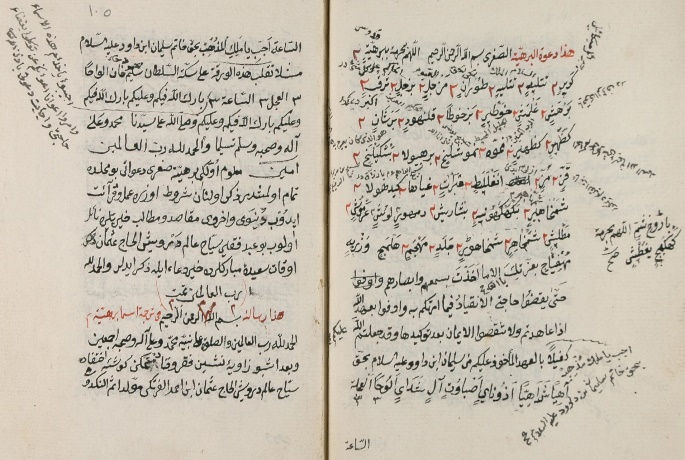
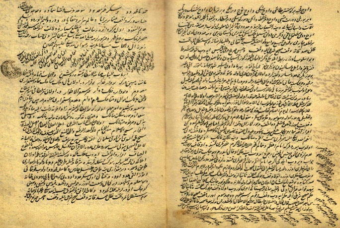
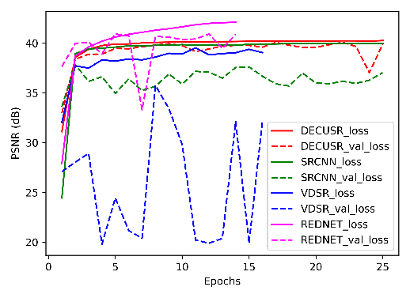
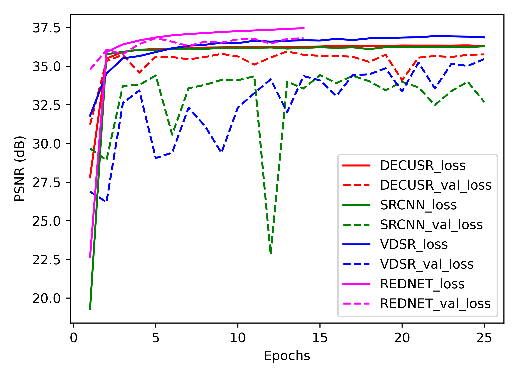
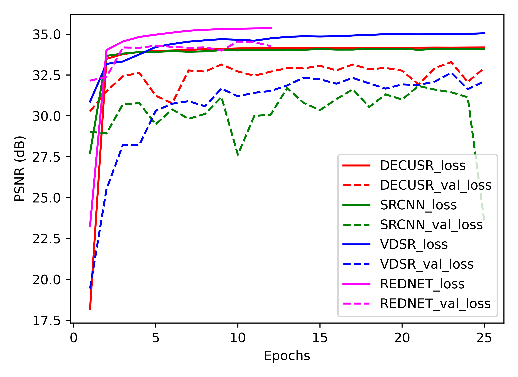
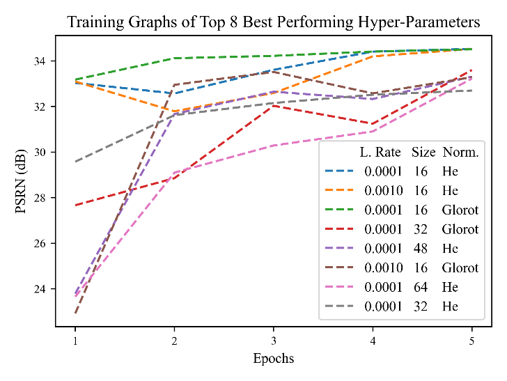

  -----------------------------------------------------------------------------------------------------------------------------------------------------
  {width="2.1392410323709536in"   
  height="0.6132370953630796in"}                                                                        
  ----------------------------------------------------------------------------------------------------- -----------------------------------------------

  -----------------------------------------------------------------------------------------------------------------------------------------------------

+----------------------+---+----------------------------------------+----+
| **Super Resolution   |   |                                        |    |
| of Historical        |   |                                        |    |
| Ottoman Text         |   |                                        |    |
| Documents**          |   |                                        |    |
+======================+===+========================================+====+
| Hakan Temiz (PhD)    |   |                                        |    |
+----------------------+---+----------------------------------------+----+
| Artvin Çoruh         |   |                                        |    |
| University,          |   |                                        |    |
| Department of        |   |                                        |    |
| Computer             |   |                                        |    |
| Engineering, 08000,  |   |                                        |    |
| Artvin, Turkiye,     |   |                                        |    |
| {width="0. |   |                                        |    |
| 16666666666666666in" |   |                                        |    |
| height="0.166        |   |                                        |    |
| 66666666666666in"}*: |   |                                        |    |
| 0000-0002-1351-7565* |   |                                        |    |
|                      |   |                                        |    |
| Corresponding Author |   |                                        |    |
| Email:               |   |                                        |    |
| htemiz@artvin.edu.tr |   |                                        |    |
+----------------------+---+----------------------------------------+----+
| https://doi.or       |   | **ABSTRACT**                           |    |
| g/10.18280/ts.xxxxxx |   |                                        |    |
+----------------------+---+----------------------------------------+----+
|                      |   |                                        |    |
+----------------------+---+----------------------------------------+----+
| **Received:**        |   | Ottoman empire left behind a           |    |
|                      |   | magnificent archive treasure that      |    |
| **Accepted:**        |   | could shed light on centuries-old      |    |
|                      |   | history. It is of great importance to  |    |
|                      |   | transfer this rich and historical      |    |
|                      |   | heritage to the present and the        |    |
|                      |   | future. There have been several        |    |
|                      |   | serious digital archive transformation |    |
|                      |   | and collection studies carried out in  |    |
|                      |   | order to unearth this enormously rich  |    |
|                      |   | content and transfer it to future      |    |
|                      |   | generations. The quality of the        |    |
|                      |   | digitized archive documents can        |    |
|                      |   | directly affect the success of the     |    |
|                      |   | tasks such as text search, text        |    |
|                      |   | analysis, character recognition, etc.  |    |
|                      |   | This study aimed to improve the        |    |
|                      |   | resolution and thus the image quality  |    |
|                      |   | of Ottoman archive text images with    |    |
|                      |   | four different deep learning based     |    |
|                      |   | super resolution (SR) algorithms:      |    |
|                      |   | VDSR, SRCNN, DECUSR, and RED-Net. The  |    |
|                      |   | performances of the algorithms were    |    |
|                      |   | measured with SSIM, PSNR, SCC and VIF  |    |
|                      |   | image quality measures (IQMs), and     |    |
|                      |   | evaluated also in terms of human       |    |
|                      |   | visual system. The algorithms received |    |
|                      |   | very encouraging IQM scores and        |    |
|                      |   | considerably good image quality.       |    |
|                      |   | Experimental studies have shown that   |    |
|                      |   | the SR application with deep learning  |    |
|                      |   | algorithms are very promising in       |    |
|                      |   | improving the resolution of historical |    |
|                      |   | Ottoman text images. It is also clear  |    |
|                      |   | that the SR implementation will allow  |    |
|                      |   | techniques such as character           |    |
|                      |   | recognition, text processing and       |    |
|                      |   | analysis on archive documents to be    |    |
|                      |   | applied more successfully.             |    |
+----------------------+---+----------------------------------------+----+
| ***Keywords:***      |   |                                        |    |
|                      |   |                                        |    |
| *historical text     |   |                                        |    |
| image, super         |   |                                        |    |
| resolution, ottoman, |   |                                        |    |
| archive, document,   |   |                                        |    |
| deep learning*       |   |                                        |    |
+----------------------+---+----------------------------------------+----+

**1. INTRODUCTION**

Super resolution (SR) of historical document images is becoming an
important prerequisite for the design and development of powerful
document processing and analysis systems. Text image super resolution
(TISR) takes an important role in this context for such systems as it
aims at improving their resolution and quality. Its important role is
also due to the low quality of historical documents, often due to
various negative deformations, wear and deterioration. However, many
factors such as the properties of scanning devices and the lighting
level of the environment directly affect the resolution and quality, and
therefore, make it difficult to read, process and analyze the content of
historical documents. Undoubtedly, improving the resolution of those
documents will contribute to the processing and analysis of such
historical text images.

The Ottoman Empire has left an enormous archival legacy of incredible
size and richness. However, approximately 150 million documents in the
Ottoman archive today correspond to only 25-30% of the main archive of
the empire \[1\]. Ottoman archives manifest in many different forms:
books, documents, magazines, newspapers, maps, postcards, manuscripts,
paintings, photographs and others. There are many studies on
transferring the archive documents in the Ottoman archives to digital
media. A considerable amount of the studies on the transfer of this
cultural heritage is the character recognition, text search, automatic
translation, etc. Many factors come into play in the field of image
processing when converting Ottoman archive documents into digital
images. The first of these is the resolution of the image, which is one
of the factors that most affect the image quality.

This study performed an SR application on Ottoman text images to improve
their actual quality and resolution. In this context, four different
deep learning (DL) models, which have proven their success in other
image types---e.g., daily images, medical images---other than text
images, have been utilized. Models were trained to magnify the text
images by 2, 3 and 4 times, and their performance was measured with four
different image quality metrics (IQM). The performances of the models
were also examined in terms of the human visual system. Studies have
shown that the resolution and thus the image quality of Ottoman archive
text images can be improved efficiently. Thanks to TISR made on Ottoman
archives, works such as optical character recognition, text analysis,
text search, image analysis will be more successful. To the best of our
knowledge, this is the first study in which resolution improvement with
SR was performed for Ottoman archive documents.

**2. LITERATURE**

In essence, SR is an algorithmic solution for improving resolution by
leveraging image-specific apriori knowledge. It is a very hot and widely
implemented research problem applied to plenty of imaging
modalities---daily photographs, aerial imaging, medical imaging, etc. An
SR effort is to produce finer details not present in the observed
low-resolution (LR) version of high-resolution (HR) images while
enlarging it by a scale factor.

Let $x$ be desired HR image---e.g., sampled above Nyquist sampling rate
from a continuous scene---,and $y$ be LR image(s) of $x$, where can be
obtained by:

$y(i,j\mathfrak{)\  = \ D(B(\ M(}x\mathfrak{)))\  + \ n(}i,\ j)$ (1)

Where $y$ and $x$ represent LR and HR images, respectively.
$\mathfrak{M,}$ $\mathfrak{B}$ and $\mathfrak{D}$ are the functions of
warping, blurring, downsampling operations, respectively. η is the term
for an additive noise. According to (1), SR poses an inverse problem
that HR images can be predicted from their LR counterparts.

The algorithms in the last decades aimed to recover the relations
between LR and HR images by exploiting a variety of learning algorithms
\[2\]\[3\]\[4\]\[5\]. Furthermore, very recent---e.g., example-based
apriori learning---ones have involved deep learning (DL) algorithms with
special architectures. Such as convolutional neaural networks (CNN)
\[6\]\[7\]\[8\], AutoEncoders \[9\]\[10\]\[11\], generative adversarial
networks (GAN) \[12\]\[13\]\[14\]\[15\], etc. Since the application of
SR in other imaging modalities and research fields is not within the
scope of the study, interested researchers may refer to the following
survey articles \[16\]\[17\].

While not as common as applied to many image types (optical, medical,
aerial, etc.), SR has also been applied to text document images for the
success of systems for processing and analyzing such type of images
(documents). Nayef et al. \[18\] designed an example based TISR of
single text images with selective patch processing technique. Banerjee
and Jawahar have offered a Markov Random Field (MRF) based TISR
algorithm for text document images \[19\]. The technique was focused
especially on preserving sharp corners by implementing the local edge
direction with gradient field and its tangent. Dalley, Freeman and Marks
\[20\] proposed Single-frame text super-resolution involving a Bayesian
approach on several languages: English, Chinese, Japanese, and Korean.
Sattar and Tay \[21\] introduced the fuzzy logic to implement a
multiresolution methodology on scanned binary documents. Fu et al.
\[22\] implemented a cascaded network, each sub-network magnifying input
image by 2x factor, to preserve the details in the document images. To
increase the OCR accuracy on the English and Chinese text images, Su et
al. \[23\] developed a deep GAN architecture for improving the
resolution. Peng and Wang have also tried recently to improve OCR
accuracy on text images by implementing an image generator of a GAN
architecture \[24\].

Encouraging research to work on a particular subject is of great
importance in terms of paving the way for development in the related
field. For this purpose, competitions are held from time to time in
various research domains. Peyrard et al. \[25\] established a text image
SR competition to encourage research in TISR domain. The competition
focused specifically on document images extracted from video streams.
The performances of four submitted models were tested on a dataset
specially constituted for the competition, and the SRCNN \[6\] model won
the competition.

There are also some research studies to improve the quality of text
documents in the form of images but focused on the techniques other than
TISR. E.g., Kodym and Hradis \[26\] aimed at improving readability and
perceived quality of the OCR of text documents. They struggled on image
enhancement and restoration by focusing specially on debinarization,
text line inpainting and text deblurring. They have implemented a
modified U-NET \[27\] architecture for this purpose. Nguyen and others
proposed a GAN to recover degraded historical documents \[28\]. Uzun,
Özer and Türkmen \[29\] have spent an effort to improve the OCR quality
of Ottoman archive documents with a CNN architecture. However, they are
out of the scope of this study as these efforts do not involve the
implementation of TISR.

As a result of diligent literature surveys, no study has been found that
applied TISR on Ottoman archive documents. In this context, this study
is a first. Furthermore, most studies applied to other text images have
applied their techniques to relatively small sized image documents or
fragments of documents, but this work required to process large-sized
image documents since they were in a form of large-size paper, newspaper
or book. Additionally, most studies make use of text images that are
converted to binary images before processing. On the contrary, in this
study, archive text documents were introduced to the experiment as they
were obtained during the scanning process.

**3. MATERIALS AND METHODS**

To implement SR on Ottoman archive documents, four different models were
used: VDSR \[7\], SRCNN \[6\], DECUSR \[8\] and RED-Net \[9\]. Since the
original architecture of some of these models--to be discussed in the
following sections--was not designed to process 3-channel images, they
were modified to process 3-channel images. The same data set as in
\[30\] were used in the experiments. The dataset was constituted with
the images collected from www.wikilala.com \[31\], where many historical
documents and other materials are made available to its subscribers.
This website, among other services it provides, also allows text search
in historical Ottoman documents. The following sub sections present the
details of the experiments such as dataset, models, training, test and
results. Let us start with the dataset.

***3.1. Dataset***

There have been several serious digital archive transformation and
collection studies carried out in order to unearth this enormously rich
content and transfer it to future generations. Some of these were
initiated by the state, while others were initiated by public
institutions and private enterprises. Very few of them are as follows:
Wikilala \[31\], Muteferriqa \[32\], Department of State Archives of
Republic of Turkiye \[33\].

In this study, text images were collected from the Wikilala dataset.
Total of 1166 historical text images were taken from the dataset, and
were randomly and proportionally separated for training, testing and
validation. Of them, 100 images are reserved for validation and another
100 for testing. The remaining 966 images were used for the training
purposes. The web site serves images of the documents within pdf files
consisting single or multi-page depending on the content. In essence,
the images in the pdf files are of color scanned jpg files. The embedded
jpg images were extracted from the pdf files with a program developed
for this purpose.

As with all historical documents, unfavorable visual degradations,
various shades and impurities were pervasively observed on these
documents as well since they have been subjected to aging, wear,
contamination, mouse droppings and peeing, etc. The text on the back
pages of some scanned documents is also vaguely visible on the front
page. Most of the images are books, notebooks, etc., which consist of
manuscripts. Although the majority are handwritten documents, there are
also printed documents such as newspaper pages. Some images are of poor
visual quality due to insufficient lighting, contrast saturation, or
scan sharpness. However, images are generally scanned at quite large
sizes. The size of some images (width and height) reaches 4-5 thousand
pixels of resolution. Some example images of the data set are given in
Figure 1.

{width="3.3070866141732282in"
height="2.2244094488188977in"}
{width="3.3070866141732282in"
height="2.2244094488188977in"}

**Figure 1.** Two examples of Ottoman archive text images.

***3.2. Models and Training***

This section discusses the details of the models, given in alphabetical
order, and implementation details of the training.

*3.2.1. DECUSR*

DECUSR was originally designed to process single-channel B-mode
ultrasound images. Therefore, the network has been modified to process
3-channel images by inclusion of additional two filters in the last
layer. The batch size value is 256. The initial learning rate was set to
1E-4 and programmatically halved when there is no improvement in its
performance for successive 10 epochs. The dimensions of the input image
fragments were determined in a similar way to the original. Namely,
16x16 pixel image pieces with 10 pixel interval, 11x11 pixel image
segments with 7 pixel interval and 8x8 image segments with 4 pixel
interval were taken from the training images for 2, 3, and 4 scale
factors, respectively. The \'He Normal\' method was used to initialize
the layer weights. A series of studies were carried out to find the most
successful parameter set of the model. These efforts were described in
detail in the Ablation Study section.

*3.2.2. SRCNN*

The SRCNN model is originally designed to process the Y-channel of the
YCbCr color space, which can be considered a single-channel image. Two
additional filters were added to the last layer of the model, as applied
to DECUSR, to make it suitable for processing 3-channel RGB images.
Except for the channel increase in the last layer, the architecture of
the network is exactly the same as the original. This model, which
originally had around 8 thousand parameters, turned into a structure
with 20,099 parameters after the channel adjustment.

The Learning rate is a hyper-parameter value that determines how much
the layer weights will be updated in response to the error between the
estimation of the model and the expected output during training of a
model. In most studies, it has been seen that taking an initial value
between 1E-3 and 1E-4 directly contributes to the rapid and successful
learning of the model. Hence, the initial learning rate is taken as
1E-3. The Batchsize value is taken as 512. The model was trained with
33x33 pixel image patches taken at 11 pixel intervals from the training
images, in line with the original article. The model's weights were
initialized with the Glorot Uniform method.

*3.2.3. VDSR*

VDSR was also trained to enlarge images by 2x, 3x and 4x scales. The
training was carried out for a maximum of 25 epochs. Adam optimizer was
chosen as the optimizing algorithm. The initial learning rate was set to
1E-4 and halved when its performance have not increased for successive
15 epochs. The activation function was ReLU. The total number of
parameters of the network is 668,227. The network was trained with image
patches with 41x41 pixels in such a way that they do not overlap each
other--taking each one 41 pixel apart. Batchsize was 256. The weights of
the model were initialized with the \'He Normal\' method.

When the training graphs are examined, though the training curve of VDSR
for 2x magnification offers a relatively steady course, the validation
curve followed a highly fluctuating course. As can be seen from the
figure, the training was automatically terminated by the early stopping
procedure at the 16th epoch due to the lack of improvement in the
performance. However, the both training and validation curves of the
other scales--3x and 4x--follow a relatively better smooth course. So,
as happened in this experiment, some training processes may not converge
nor be consistent in some cases.

The preliminaries of this model was presented in the conference paper
\[30\]. More details for the implementation and results can be found in
this paper.

*3.2.4. RED-Net*

RED-Net is a relatively large-parameter model with encoder-decoder
architecture. The first part of the algorithm operates as the encoder
and the second part as the decoder. The output of the layers in the
encoder section is given symmetrically in the decoder section with a
shortcut link (skip connections) to the layers in the same symmetrical
order. The RED30 model in the original study was used in our study. 64
filters of 3x3 kernels were used in the layers. Only the last layer has
as many filters as the number of color channels of the rendered image.
In this study, the same way as in the original, Adam optimizer was used
and the initial learning rate was taken as 1E-4.

*3.2.5. Common Training Details*

In the trainings, the images were normalized by dividing by the maximum
intensity value (255.0) before being fed to the networks. The bicubic
interpolation method was used for the downsampling process. The
mean-squared-error (MSE), whose formula is given in the following
sections, was used as the penalty function. The same seed value was used
in all studies to ensure reproducibility. Developments and all
experiments were performed with the DeepSR \[34\] framework, which
provides an integrated environment for all processes of the SR
task---design, training, test, visualization, etc. The Tensorflow was
chosen as the backend. All training, testing and validation processes
were carried out on a computer with NVIDIA GeForce 2080Ti GPU. Table 1
provides some information about the models and trainings.

**Table 1.** The number of parameters and training times of the
algorithms.

  -------------------------------------------------------------------------
  **Models**     **Parameters**    **Training                 
                                   Time                       
                                   (hours)**                  
  -------------- ----------------- ------------- ------------ -------------
                                   Scale-2       Scale-3      Scale-4

  DECUSR         40,995            27.839        22.790       21.822

  SRCNN          20,099            40.234        42.607       41.801

  VDSR           668,227           26.303        40.605       40.147

  RED-Net        1,037,507         90.047        89.099       91.0284
  -------------------------------------------------------------------------

  --------------------------------------------------------------------------------------------------------------------------------------------------------------------------------------------------------------------------------------------------------------------------------------------
  {width="2.3555555555555556in"   {width="2.3555555555555556in"   {width="2.3555555555555556in"
  height="1.7131944444444445in"}                                                                 height="1.7131944444444445in"}                                                                 height="1.7131944444444445in"}
  ---------------------------------------------------------------------------------------------- ---------------------------------------------------------------------------------------------- ----------------------------------------------------------------------------------------------
  2x Scale                                                                                       3x Scale                                                                                       4x Scale

  --------------------------------------------------------------------------------------------------------------------------------------------------------------------------------------------------------------------------------------------------------------------------------------------

**Figure 2.** Training performances of the four models in PSNR.

The training graphs of the models in PSNR measure are given in Figure 2.
In the figures, the red, green, blue and magenta lines belong to DECUSR,
SRCNN, VDSR and RED-Net, respectively. While the continuous lines show
the training performance of the networks, the dashed lines indicate
validation performance. Each column shows the training graph performed
for the scales 2, 3 and 4---from left to right, respectively.

Because its performance did not improve for several epochs when training
it for the 2x scale magnification, the training procedure of VDSR was
terminated in the 16th epoch by early-stopping procedure. In addition,
it can also easily be observed that it exhibits a rather fluctuating
performance for this scale factor. Although the training graph of SRCNN
is very close to the graph of DECUSR, it constantly remained below. The
training and validation curves of RED-Net are generally above the other
models. However, its training lasted around 14th epoch due to no
improvement in the validation procedure for certain epochs, as happened
to VDSR for 2x scale factor. This mechanism was set to prevent the
overfitting. Although the training curve of VDSR is above the other two
for the scales 2 and 4, its validation curves notably laid below them,
with some exceptions where SRCNN's scores remain low. This may actually
be a sign that it does not learn very well and is prone to overfit.
Nevertheless, for the scale 3, both curves of VDSR are dramatically
below the others. While the training curve of SRCNN is almost at the
same level as the other models, the validation curve occurs at
significantly lower levels. In addition, its validation curve is very
fluctuating as well, which may be an indication of its instability in
learning. DECUSR showed very stable and smooth-increasing training and
validation curves until the end of the training. This should be a sign
that the algorithm has a high ability to learn the transformation
function from LR text image to HR text image.

***3.3. Test***

The performances of the algorithms were quantitatively evaluated by the
following image quality metrics (IQM): Peak Signal to Noise Ratio
(PSNR), Structural Similarity Index (SSIM) \[35\] , Spatial Correlation
Coefficient (SCC) \[36\] and Visual Information Fidelity (VIF) \[37\].
PSNR and SSIM are discussed in more detail in the following sections as
they are more common IQMs.

**Peak Signal to Noise Ratio (PSNR)**

PSNR is a measure of the ratio of the maximum possible power of a signal
to the power of noise affecting its representation fidelity. In short,
it is the ratio of the maximum intensity value to the MSE---whose
definition is given in (2)---between two images in logarithmic decibel
(dB) scale. In image processing, it measures the discrepancy between
reference and predicted image, and its value may range between 30 dB and
50 dB for 8-bit data \[38\]. The higher value of PSNR, the higher image
quality.

The formal definition of PSNR is given in (3). Let us denote y and $ŷ$
respectively the reference and predicted image. MSE measures the
distance between the images y and $ŷ$. It is defined as follows:

  ---------------------------------------------------------------------------------------------------------------
  $$\ \ MSE = \frac{1}{PR}\sum_{i = 1}^{P}{\sum_{j = 1}^{R}\left\| y(i,j) - ŷ(i,j) \right\|^{2}}$$   \(2\)
  -------------------------------------------------------------------------------------------------- ------------

  ---------------------------------------------------------------------------------------------------------------

where P and R denote the number of pixels in the height and width,
respectively. PSNR is then computed as follows:

  -----------------------------------------------------------------------
  $$\ \ PSNR = 0\log_{10}\left( \frac{^{}}{\sqrt{}} \right)$$    \(3\)
  -------------------------------------------------------------- --------

  -----------------------------------------------------------------------

where L is the maximum intensity value, which is 255.0 in our case (for
8-bit images).

**Structural Similarity Index (SSIM)**

SSIM measures perceptual quality of images with the similarity between
two images---predicted and reference---in terms of three criteria:
luminance, contrast, and structure. It incorporates some kind of
gradient similarity functions to measure similarity, or in other saying,
dissimilarity. The perceptual quality of an image is measured from three
aspects: luminance, contrast, and structure. The product of
above-mentioned three criteria computes the similarity score. SSIM
considers the interdependencies of pixels in luminance, contrast, and
structural terms. For given images y and $ŷ$, it is defined as follows:

  -------------------------------------------------------------------------------------------------------------------------------------------------------------------------
  $$SSIM(y,ŷ) = \frac{({2\mu}_{y}\mu_{ŷ} + c_{1})({2\sigma}_{yŷ} + \ c)}{(\mu_{y}^{2} + \ \mu_{ŷ}^{2} + \ c_{1})(\sigma_{y}^{2} + \ \sigma_{ŷ}^{2} + \ c_{2})}$$   \(4\)
  ---------------------------------------------------------------------------------------------------------------------------------------------------------------- --------

  -------------------------------------------------------------------------------------------------------------------------------------------------------------------------

where $\mu$ and $\sigma$ are terms of the mean and variance of the
corresponding image, and $\sigma_{yŷ}$ is the covariance between both
images. The coefficients $c_{1}$ and$\ c_{2}$ are calculated as follows:

  -----------------------------------------------------------------------
  $$c_{1} = \left( k_{1}L \right)^{2}$$                         \(5\)
  ------------------------------------------------------------- ---------
  $$c_{2} = \left( k_{2}L \right)^{2}$$                         \(6\)

  -----------------------------------------------------------------------

The maximum density L is 255.0 for 8-bit images, and the default values
of $k_{1}and\ k_{2}\ are\ 0.01$ and $0.03$, respectively. SSIM is in the
range of \[0,1\]. The values of 1.0 and 0.0 indicate the highest and
poorest image quality, respectively.

**SCC** is measure of the correlation between two images by dividing
their covariance by the product of their standard deviations.

**VIF** is a statistics model that measures the image deformations such
as blur, additional noise, and local or general contrast changes, and
takes into account the information theoretical setting of the human
visual system.

In addition to the quantitative evaluation, qualitative evaluations were
made in terms of the human visual system by examining some excerpts from
the output text images of the algorithms. They are given in the next
section.

**4. RESULTS**

The performances of the algorithms in IQMs are given in Table 2. The
highest scores are indicated with bold text and the second with the
asterisk (\*). The highest and second highest scores were always
obtained alternately by DECUSR and RED-Net algorithms. When one of them
has the highest score, the other has the second highest. According to
the table, the modified DECUSR model achieved the highest scores in all
metrics other than SCC for the scale 2, where RED-Net offered the
highest. In PSNR measure for the scale 3, DECUSR holds the highest
score. The other IQMs found the RED-Net the highest. RED-Net achieved
the highest scores in all IQMs for the scale 4. VDSR yielded the third
best scores in all IQMs. On the other hand, SRCNN achieved the lowest
scores in all IQMs at each scale factor. Overall, the algorithms
achieved remarkably high scores. For example, nearly all of the
algorithms scored above 30 dB in PSNR and over 0.9 in SSIM at all
scales. Even at the scale factor of two, the algorithms---E.g.,
DECUSR---reached 35.3151dB and 0.9553 in PSNR and SSIM respectively. In
particular, the fact that the SSIM value is very close to 1.0 indicates
that the success of the algorithm(s) in recovering structural finer
details from LR text images. Such appealing achievements are a good
indication that the algorithms can successfully produce higher
resolution, and thus better quality images. Therefore, they are quite
promising in TISR. To assess the algorithms in terms of human visual
system, some excerpts of two predicted images by the algorithms at each
scale are given in Figure 3.

**Table 2.** Scores of the algorithms for scales 2, 3 and 4.

  ----------------------------------------------------------------------------------
  ***Scale***   ***Model***   ***PSNR***      ***SCC***    ***SSIM***   ***VIF***
                              ***(dB)***                                
  ------------- ------------- --------------- ------------ ------------ ------------
  2x            DECUSR        **35.3151**     \*0.6216     **0.9553**   **0.6535**

                SRCNN         34.1752         0.5629       0.9391       0.5921

                VDSR          30.3865         0.5859       0.9406       0.6159

                RED-Net       \*34.2038       **0.6415**   \*0.9522     \*0.6480

  3x            DECUSR        **32.7401**     \*0.3847     \*0.9072     \*0.5245

                SRCNN         31.2075         0.3150       0.8882       0.4777

                VDSR          32.2727         0.3799       0.9046       0.5175

                RED-Net       \*32,6412       **0.3876**   **0.9094**   **0.5340**

  4x            DECUSR        \*30.7326       \*0.2571     \*0.8603     \*0.4374

                SRCNN         28.7886         0.1970       0.8342       0.3862

                VDSR          30.0878         0.2549       0.8569       0.4267

                RED-Net       **31.0851**     **0.2689**   **0.8680**   **0.4574**
  ----------------------------------------------------------------------------------

The figure shows the reference image patch for two different test text
images and the images of the same region predicted by the algorithms at
each scale.

When examining the figure, overall, the algorithms achieved remarkably
good results in recovering the details and high-frequency features. For
the scale factor of two, DECUSR obtained a sharper and clearer image
than the others. Besides, the text image produced by RED-Net looks
similarly clear. SRCNN and VDSR, on the other hand, created aliasing
especially at the edges. This aliasing effect can be seen very clearly,
especially in the output images of SRCNN at higher scales. At higher
scales, RED-Net produced much clearer and more successful image quality
than the others, supporting the numerical results. On the other hand,
DECUSR has also produced considerably good-quality text images. However,
as the scale grows, TISR performance of every algorithm decreases
noticeably, as expected. While a clearer image is obtained at lower
scales, the images commonly become increasingly blurred as the scale
increases.

In general, DECUSR produces very good text images at lower scales,
whereas RED-Net provides slightly better performance at higher scales.
However, the difficulties in applying RED-Net in real-world applications
should be taken into account in the assessment. Because RED-Net is such
a large model, it causes memory problems. Memory issues don\'t pose much
of a problem in training, since training is accomplished by introducing
very small patches of images---as is always the case---but it becomes
almost impossible to run this model to process larger full-size images
on GPUs, as happened in this experimental study. For this reason, all
tests of this model had to be done with the computer\'s CPU rather than
the GPU, and took days to accomplish. It is obvious that such
implementation problems will make it difficult to apply algorithms to
real-life problems.

In overall, the quantitative and qualitative analyses of the experiments
clearly showed that the algorithms produced very promising results in
the application of TISR on Ottoman archive text images.

**5. CONCLUSION**

The Ottoman Empire left behind a magnificent archive treasury. There are
countless records and archives that can shed light on the centuries-old
history of the lives, dreams and knowledge of tens of generations. It is
of great importance to transfer this rich and historical heritage to the
present and the future. In this context, a serious digital archive
transformation and collection studies have been carried out. In
particular, the quality of the digitized texts in terms of resolution
will directly contribute to the success of the tasks for various
purposes---e.g., text search, text analysis, and other transactions.

In this study, the resolution and quality of Ottoman archive text images
were tried to be improved with SR techniques. In this context, four
different models were trained to magnify text images 2, 3 and 4 times
and tested both quantitatively and qualitatively. The performance of the
models was found to be quite promising. This study clearly showed that
SR application in archive text images will contribute positively to the
processing and analysis processes of such images.

+-------------+---+------------+------------+------------+------------+
|             |   | DECUSR     | SRCNN      | VDSR       | RED-Net    |
+=============+===+============+============+============+============+
| {width= |   | image9.png | mage10.png | mage11.png | mage12.png |
| "1.29921259 |   | ){width="1 | ){width="1 | ){width="1 | ){width="1 |
| 84251968in" |   | .299212598 | .299212598 | .299212598 | .299212598 |
| height="    |   | 4251968in" | 4251968in" | 4251968in" | 4251968in" |
| 1.119616141 |   | height="1  | height="1  | height="1  | height="1  |
| 7322834in"} |   | .119615048 | .119615048 | .119615048 | .119615048 |
|             |   | 118985in"} | 118985in"} | 118985in"} | 118985in"} |
| Reference   |   |            |            |            |            |
| text image  |   |            |            |            |            |
+-------------+---+------------+------------+------------+------------+
|             |   |            |            |            |            |
+-------------+---+------------+------------+------------+------------+
|             | 3 | ![]        | ![]        | ![]        | ![]        |
|             | x | (vertopal_ | (vertopal_ | (vertopal_ | (vertopal_ |
|             |   | ab33e5c62a | ab33e5c62a | ab33e5c62a | ab33e5c62a |
|             |   | 6b416b8dfa | 6b416b8dfa | 6b416b8dfa | 6b416b8dfa |
|             |   | d1948c82e6 | d1948c82e6 | d1948c82e6 | d1948c82e6 |
|             |   | e0/media/i | e0/media/i | e0/media/i | e0/media/i |
|             |   | mage13.png | mage14.png | mage15.png | mage16.png |
|             |   | ){width="1 | ){width="1 | ){width="1 | ){width="1 |
|             |   | .299212598 | .299212598 | .299212598 | .299212598 |
|             |   | 4251968in" | 4251968in" | 4251968in" | 4251968in" |
|             |   | height="1  | height="1  | height="1  | height="1  |
|             |   | .119615048 | .119615048 | .119615048 | .119615048 |
|             |   | 118985in"} | 118985in"} | 118985in"} | 118985in"} |
+-------------+---+------------+------------+------------+------------+
|             |   |            |            |            |            |
+-------------+---+------------+------------+------------+------------+
|             | 4 | ![]        | ![]        | ![]        | ![]        |
|             | x | (vertopal_ | (vertopal_ | (vertopal_ | (vertopal_ |
|             |   | ab33e5c62a | ab33e5c62a | ab33e5c62a | ab33e5c62a |
|             |   | 6b416b8dfa | 6b416b8dfa | 6b416b8dfa | 6b416b8dfa |
|             |   | d1948c82e6 | d1948c82e6 | d1948c82e6 | d1948c82e6 |
|             |   | e0/media/i | e0/media/i | e0/media/i | e0/media/i |
|             |   | mage17.png | mage18.png | mage19.png | mage20.png |
|             |   | ){width="1 | ){width="1 | ){width="1 | ){width="1 |
|             |   | .299212598 | .299212598 | .299212598 | .299212598 |
|             |   | 4251968in" | 4251968in" | 4251968in" | 4251968in" |
|             |   | height="1  | height="1  | height="1  | height="1  |
|             |   | .119615048 | .119615048 | .119615048 | .119615048 |
|             |   | 118985in"} | 118985in"} | 118985in"} | 118985in"} |
+-------------+---+------------+------------+------------+------------+
|             |   |            |            |            |            |
+-------------+---+------------+------------+------------+------------+

+-------------+---+------------+------------+------------+------------+
| {width= |   | mage22.png | mage23.png | mage24.png | mage25.png |
| "1.29921259 |   | ){width="1 | ){width="1 | ){width="1 | ){width="1 |
| 84251968in" |   | .299212598 | .299212598 | .299212598 | .299212598 |
| height="    |   | 4251968in" | 4251968in" | 4251968in" | 4251968in" |
| 1.120010936 |   | height="1  | height="1  | height="1  | height="1  |
| 1329833in"} |   | .119615048 | .119615048 | .119615048 | .119615048 |
|             |   | 118985in"} | 118985in"} | 118985in"} | 118985in"} |
| Reference   |   |            |            |            |            |
| text image  |   |            |            |            |            |
+=============+===+============+============+============+============+
|             |   |            |            |            |            |
+-------------+---+------------+------------+------------+------------+
|             | 3 | ![]        | ![]        | ![]        | ![]        |
|             | x | (vertopal_ | (vertopal_ | (vertopal_ | (vertopal_ |
|             |   | ab33e5c62a | ab33e5c62a | ab33e5c62a | ab33e5c62a |
|             |   | 6b416b8dfa | 6b416b8dfa | 6b416b8dfa | 6b416b8dfa |
|             |   | d1948c82e6 | d1948c82e6 | d1948c82e6 | d1948c82e6 |
|             |   | e0/media/i | e0/media/i | e0/media/i | e0/media/i |
|             |   | mage26.png | mage27.png | mage28.png | mage29.png |
|             |   | ){width="1 | ){width="1 | ){width="1 | ){width="1 |
|             |   | .299212598 | .299212598 | .299212598 | .299212598 |
|             |   | 4251968in" | 4251968in" | 4251968in" | 4251968in" |
|             |   | height="1  | height="1  | height="1  | height="1  |
|             |   | .119615048 | .119615048 | .119615048 | .119615048 |
|             |   | 118985in"} | 118985in"} | 118985in"} | 118985in"} |
+-------------+---+------------+------------+------------+------------+
|             |   |            |            |            |            |
+-------------+---+------------+------------+------------+------------+
|             | 4 | ![]        | ![]        | ![]        | ![]        |
|             | x | (vertopal_ | (vertopal_ | (vertopal_ | (vertopal_ |
|             |   | ab33e5c62a | ab33e5c62a | ab33e5c62a | ab33e5c62a |
|             |   | 6b416b8dfa | 6b416b8dfa | 6b416b8dfa | 6b416b8dfa |
|             |   | d1948c82e6 | d1948c82e6 | d1948c82e6 | d1948c82e6 |
|             |   | e0/media/i | e0/media/i | e0/media/i | e0/media/i |
|             |   | mage30.png | mage31.png | mage32.png | mage33.png |
|             |   | ){width="1 | ){width="1 | ){width="1 | ){width="1 |
|             |   | .299212598 | .299212598 | .299212598 | .299212598 |
|             |   | 4251968in" | 4251968in" | 4251968in" | 4251968in" |
|             |   | height="1  | height="1  | height="1  | height="1  |
|             |   | .119615048 | .119615048 | .119615048 | .119615048 |
|             |   | 118985in"} | 118985in"} | 118985in"} | 118985in"} |
+-------------+---+------------+------------+------------+------------+

**Figure 3.** Excerpts from the predictions of the algorithms for two
text images.

**ABLATION STUDY**

This section describes how the best hyper-parameter set was found for
the modified DECUSR model. In order to find the parameter sets that
maximizing the performance of DECUSR, a grid search method was performed
for the following three criteria: learning rate, input image patch size,
and initialization method for layer weights. The following values were
taken for the learning rate: 1E-2, 1E-3 and 1E-4. For the kernel
initialization, "He Normal" and "Glorot Uniform" methods were adopted.
For the image sizes, the following pixel sizes were examined: 16x16,
32x32, 48x48 and 64x64 pixels. Entire values of each criteria are given
in Table 3.

**Table 3.** Values and techniques used in the grid search for finding
the best hyper parameter set. The calculation efficiency under different
image patch sizes and learning rates is also an important indicator.

  ------------------------------------------------------------------------
  **Learning Rate**   **Image Patch Size**   **Kernel Initialization**
  ------------------- ---------------------- -----------------------------
  1E-2                16x16                  He Normal

  1E-3                32x32                  Glorot Uniform

  1E-4                48x48                  

                      64x64                  
  ------------------------------------------------------------------------

During the grid search process, DECUSR was trained to have a maximum of
5 epochs for each of a total of 24 different parameter combinations.
Afterwards, each model was tested on the test set. The top 8 models that
presented the most successful performance graph---in PSNR score--- were
examined and the best among these was selected according to the
performance value and training curve. The performance curve of the top 8
models is given in Figure 4.

{width="3.163415354330709in"
height="2.1994892825896764in"}

**Figure 4.** The top 8 training performances of DECUSR according to the
three criteria: learning rate, image patch size and kernel initializer.

When the characteristics of the top eight models are examined from the
figure, it was observed that 7 out of 8 models and especially the first
one were trained with the learning rate value of 1E-4. The top three
models, and 4 out of 8 models in total, were trained with 16x16 pixel
images. Additionally, the layer weights of the 5 of the 8 models and two
most successful models were initialized with the "He Normal" method. So,
according to the ablation study, it was concluded that the learning
ability of the modified DECUSR model was best when the learning rate is
1E-4, the image size is 16x16, and the He Normal method is adopted for
the kernel initialization procedure. The model was taken into
comprehensive training procedure under these findings.

**NOTE**

This paper is the extended version of the conference paper, entitled
"Towards Better Resolution of Ottoman Archive Documents" \[30\].

**REFERENCES**

\[1\] Rukancı, F. (2009). Arşiv Belgelerimizin Uluslararası Önemi.

\[2\] Yang, J., Wright, J., Huang, T., Ma, Y. (2008). Image
Super-Resolution as Sparse Representation of Raw Image Patches. 26th
IEEE Conference on Computer Vision and Pattern Recognition.

\[3\] Chang, H., Yeung, D.Y., Xiong, Y. (2004). Super-Resolution Through
Neighbor Embedding. Proceedings of the IEEE Computer Society Conference
on Computer Vision and Pattern Recognition.

\[4\] Romano, Y., Isidoro, J., Milanfar, P. (2016). RAISR: Rapid and
Accurate Image Super Resolution. IEEE Transactions on Computational
Imaging, 3(1): 110-125.

\[5\] Tang, Y., Yan, P., Yuan, Y., Li, X. (2011). Single-Image
Super-Resolution Via Local Learning. International Journal of Machine
Learning and Cybernetics, 2(1): 15-23.

\[6\] Dong, C., Loy, C.C., He, K., Tang X. (2014). Learning a Deep
Convolutional Network for Image Super-Resolution. 13th European
Conference on Computer Vision, ECCV 2014, pp.184--199.

\[7\] Kim, J., Lee, J.K., Lee, K.M. (2016) Accurate Image
Super-Resolution Using Very Deep Convolutional Networks. IEEE Conference
on Computer Vision and Pattern Recognition (CVPR), pp.1646--1654.

\[8\] Temiz, H., Bilge, H.S. (2020). Super Resolution of B-mode
Ultrasound Images with Deep Learning. IEEE Access, 8: 78808-78820.

\[9\] Mao, X.-J., Shen, C., Yang, Y.-B. (2016): Image Restoration Using
Very Deep Convolutional Encoder-Decoder Networks with Symmetric Skip
Connections. Advances in Neural Information Processing Systems,
pp.2802--2810.

\[10\] Sevinç, Ö., Mehrubeoglu, M., Güzel, M., Askerzade, I. (2022). An
effective medical image classification: Transfer learning enhanced by
auto encoder and classified with SVM. Traitement du Signal, 39(1):
125-131. https://doi.org/10.18280/ts.390112.

\[11\] Wajeed, M.A., Sreenivasulu, V. (2019). Image Based Tumor Cells
Identification Using Convolutional Neural Network and Auto Encoders.
Traitement du Signal, 36(5), 445-453.

\[12\] Ledig, C. et al. (2017). Photo-Realistic Single Image
Super-Resolution Using a Generative Adversarial Network. Proceedings of
The IEEE Conference on Computer Vision and Pattern Recognition, pp.
4681-4690.

\[13\] Zareapoor, M., Celebi, M.E., Yang, J. (2019). Diverse Adversarial
Network for Image Super-Resolution. Signal Processing: Image
Communication, 74: 191--200.

\[14\] Wu, F., Wang, B., Cui, D., Li, L. (2018). Single Image
Super-Resolution Based on Wasserstein GANs. 37th Chinese Control
Conference (CCC), pp. 9649--9653.

\[15\] Zhu, X., Zhang, L., Zhang, L., Liu, X., Shen, Y., Zhao S. (2019).
Generative Adversarial Network-based Image Super-Resolution with a Novel
Quality Loss. International Symposium on Intelligent Signal Processing
and Communication Systems (ISPACS), pp. 1--2.

\[16\] Wang, Z., Chen, J., Hoi, S.C.H. (2020). Deep Learning for Image
Super-resolution: A Survey. IEEE Transactions on Pattern Analysis and
Machine Intelligence. 43(10): 3365-3387.

\[17\] Anwar, S., Khan, S., Barnes, N. (2020). A Deep Journey into
Super-Resolution: A Survey. ACM Computing Surveys, 53(3): 1-34.

\[18\] Nayef, N., Chazalon, J., Gomez-Krämer, P., Ogier, J.-M. (2014).
Efficient Example-Based Super-Resolution of Single Text Images Based on
Selective Patch Processing. 11th IAPR International Workshop on Document
Analysis Systems, pp. 227--231.

\[19\] Banerjee, J., Jawahar, C.V. (2008). Super-Resolution of Text
Images Using Edge-Directed Tangent Field. The Eighth IAPR International
Workshop on Document Analysis Systems, pp. 76--83.

\[20\] Dalley, G., Freeman, B., Marks, J. (2004). Single-Frame Text
Super-Resolution: a Bayesian approach. International Conference on Image
Processing, ICIP '04, pp. 3295-3298.

\[21\] Sattar, F., Tay, D.B.H. (1999). Enhancement of Document Images
Using Multiresolution and Fuzzy Logic Techniques. IEEE Signal Processing
Letters, 6(10): 249--252.

\[22\] Fu, Z. et al. (2019). Cascaded Detail-Preserving Networks for
Super-Resolution of Document Images. International Conference on
Document Analysis and Recognition (ICDAR), pp. 240--245.

\[23\] Su, X., Xu, H., Kang, Y., Hao, X., Gao, G., Zhang Y. (2019).
Improving Text Image Resolution using a Deep Generative Adversarial
Network for Optical Character Recognition. International Conference on
Document Analysis and Recognition (ICDAR), pp. 1193--1199.

\[24\] Peng, X. Wang, C., (2020). Building Super-Resolution Image
Generator for OCR Accuracy Improvement. International Workshop on
Document Analysis Systems, pp. 145--160.

\[25\] Peyrard, C., Baccouche, M., Mamalet, F., Garcia, C. (2015).
ICDAR2015 Competition on Text Image Super-Resolution. 2015 13th
International Conference on Document Analysis and Recognition (ICDAR),
pp. 1201--1205.

\[26\] Kodym, O., Hradiš, M. (2022). \$\$\\hbox {TG}\^2\$\$: Text-Guided
Transformer GAN for Restoring Document Readability and Perceived
Quality. International Journal on Document Analysis and Recognition
(IJDAR), 25(1): 15--28.

\[27\] Ronneberger, O., Fischer, P., Brox, T. (2015). U-Net:
Convolutional Networks for Biomedical Image Segmentation. International
Conference on Medical Image Computing and Computer-Assisted
Intervention, 234--241.

\[28\] Nguyen, K.C., Nguyen, C. T., Hotta, S., Nakagawa, M. (2019). A
Character Attention Generative Adversarial Network for Degraded
Historical Document Restoration. International Conference on Document
Analysis and Recognition (ICDAR), pp. 420--425.

\[29\] Uzun, A., Özer, A., Turkmen, H.I. (2021). Evrişimsel Sinir Ağı
Tabanlı Osmanlıca Belge Çözümleyici. International Journal of Advances
in Engineering and Pure Sciences, 33(4): 581--591.

\[30\] Temiz, H. (2023). Towards Better Resolution of Ottoman Archive
Documents. 3rd International Conference on Engineering and Applied
Natural Sciences, pp. 564--568.

\[31\] Wikilala. https://www.wikilala.com, accessed on Mar. 02, 2022.

\[32\] Muteferriqa. https://muteferriqa.com, accessed on Nov. 02, 2022.

\[33\] Department of State Archives,
https://katalog.devletarsivleri.gov.tr, accessed on Nov 01, 2022.

\[34\] Temiz H. (2023). DeepSR: A deep learning tool for image super
resolution. *SoftwareX*, (21),101261.
https://doi.org/10.1016/j.softx.2022.101261.

\[35\] Wang, Z., Bovik, A.C., Sheikh, H.R., Simoncelli, E. P. (2004).
Image Quality Assessment: From Error Visibility to Structural
Similarity. IEEE Transactions on Image Processing, 13(4): 600--612.

\[36\] Zhou, J., Civco, D.L., Silander, J.A. (1998). A Wavelet Transform
Method to Merge Landsat TM and SPOT Panchromatic Data. International
Journal of Remote Sensing, 19(4): 743--757.

\[37\] Alparone, L., Aiazzi, B., Baronti, S., Garzelli, A., Nencini, F.,
Selva, M. (2008). Multispectral and Panchromatic Data Fusion Assessment
without Reference. Photogrammetric Engineering & Remote Sensing, 74(2):
193--200.

\[38\] Deshpande, R.G., Ragha, L.L., Sharma, S.K. (2018). Video quality
assessment through psnr estimation for different compression standards.
Indones. J. Electr. Eng. Comput. Sci., 11(3): 918--924.
